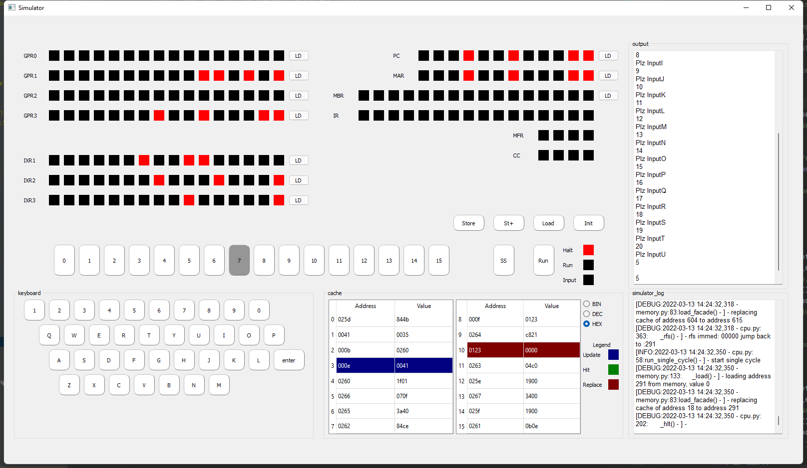
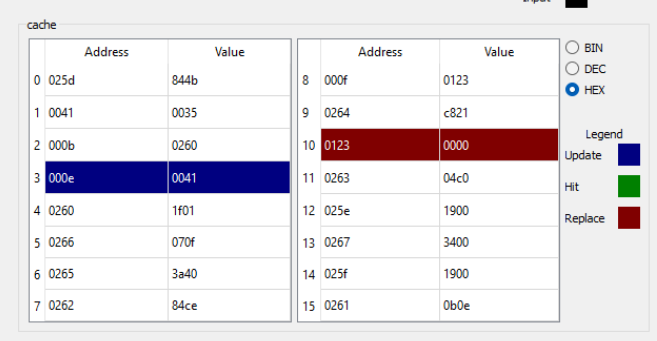
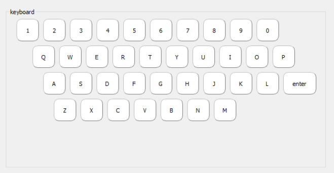
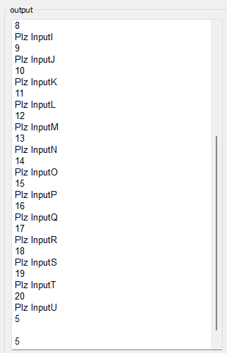
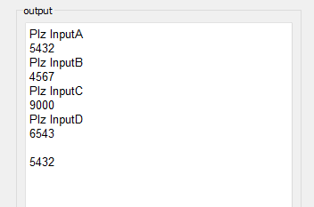

# Design note

## Project Summary

The Phase 2 of the simulator mainly focus on building these following parts

- The GUI
- The main simulator framework
- The memory
- Registers
- Instructions except trap, float point ops.
- Cache indicator
- Virtual keyboard
- Output box
- Logging box

## Project structure

```
├── LICENSE
├── README.md
├── document
│   └── project1_planning.md
├── project
│   ├── simulator_GUI.py //The entrance of code, as well as the GUI codes
│   └── src
│       ├── IPL.txt          //the IPL file for loading program
│       ├── __init__.py
│       ├── cache.py         //Define the structure of cache line
│       ├── constants.py     //Define constants that would be used across the project
│       ├── cpu.py           //Define the cpu Class, the main simulater logic happens here
│       ├── memory.py        //Define the memeory class
│       ├── mfr.py           //predifined mfr errors, to be used in phase3
│       ├── op_code_list.py  //a map of all op_codes
│       ├── register.py      //Define the register class, used to initiate the registers
│       └── word.py          //Define the word Class, which is used to hold data in both memory and register
├── requirements.txt
├── setup.py
└── tests
    ├── IPL.txt
    └── test_utils.py        //test functions to run against backend codes.
```

## The GUI

The GUI is developed with the PyQT5 framework



- As can be seen above, main GUI contains all requiring parts of phase2.

- For the simulator part, I've done certain abstractions on the register indicators and the buttons.

  - Each line of register indicator is generated by the class `RegisterGUI` . This class also provides a method `refresh_label` allowing us to simply using binary string to refresh the indicator.

  - Each button is generated by class `PressButton`. This class also provides a method `on_click` to bind corresponding method calls.

  - When `LD` button is pressed, the value on the switch will be fetched and stored into the corresponding register. After this progress completes, the GUI will fetch result from the backend and refresh the indicator.

  - All other button has the same logic: call corresponding backend function, and refresh the indicator upon finish.

  - 

  - Abstraction of register indicators: The register indicators could be represented by the following python dictionary.

    ```python
    map_reg_location = {
        # name: x_location,y_location,reg_count,button_function,has_button
        "GPR0": [40, 70, 16, cpu_instance.gpr[0].set, True],
        "GPR1": [40, 110, 16, cpu_instance.gpr[1].set, True],
        "GPR2": [40, 150, 16, cpu_instance.gpr[2].set, True],
        "GPR3": [40, 190, 16, cpu_instance.gpr[3].set, True],
        "IXR1": [40, 280, 16, cpu_instance.ixr[1].set, True],
        "IXR2": [40, 320, 16, cpu_instance.ixr[2].set, True],
        "IXR3": [40, 360, 16, cpu_instance.ixr[3].set, True],
        "PC": [780, 70, 12, cpu_instance.pc.set, True],
        "MAR": [780, 110, 12, cpu_instance.mar.set, True],
        "MBR": [660, 150, 16, cpu_instance.mbr.set, True],
        "IR": [660, 190, 16, cpu_instance.ir.set, False],
        "MFR": [1020, 230, 4, cpu_instance.mfr.set, False],
        "CC": [1020, 270, 4, cpu_instance.cc.set, False],
    }
    ```

- For console log, it mainly used `QTextEditLogger` from Pyqt5 to serve as a python log handler. This log box will catch every log the simulator program generated. 

- For Output box, it mainly used `QTextEditLogger` from Pyqt5 to serve as a simulator output. Only out command will output characters into this box.

- For cache indicator, it showed the 16 line of address and value of current cache. And will change color after cache hit/update/replace. Users can change the digit shown in the cache indicator into hexadecimal, binary or decimal by choosing in the ratio button. 

  - 

- For Keyboard part, The keyboard allows the simulator to request input from user. The keyboard will only be effective when input indicator is on. After user hit a key, the program will continue to run.

  - 

## The main simulator framework

- The main simulator framework is developed in `cpu.py`for class `CPU`.

  - Table of data structure in class `CPU`

    - | data          | usage                                                        |
      | ------------- | ------------------------------------------------------------ |
      | memory        | the memory                                                   |
      | logger        | python log stream used to output debug info                  |
      | output_log    | python log stream used to send output into the output box in GUI |
      | pc            | the pc register                                              |
      | mar           | the mar register                                             |
      | mbr           | the mbr register                                             |
      | gpr[]         | the gpr register in a list                                   |
      | ixr[]         | the ixr register in a list                                   |
      | cc            | the cc register place holder                                 |
      | mfr           | the mfr register                                             |
      | ir            | the ir register                                              |
      | halt_signal   | to indicate if halt or not                                   |
      | input_signal  | used to decide the register to fetch user's input            |
      | run_mode      | used to save the run_mode before hitting in command          |
      | cache_display | used to decide the format of cache indicator(HEX/BIN/DEC)    |
  
  - Table of method in class `CPU`
  
    - | method                 | usage                                                        |
      | ---------------------- | ------------------------------------------------------------ |
      | __init__               | used to init cpu instance, assigning registers and memory to cpu. |
      | run                    | used by run button in GUI, to run the program until halt_signal |
      | run_single_cycle       | used by SS button in GUI, to run a single instruction        |
      | store                  | used by store button in GUI, to store mbr into memory[mar]   |
      | store_plus             | used by ST+ button in GUI, to store mbr and add 1 in mar     |
      | load                   | used by load button in GUI, to load memory[mar] to mbr       |
      | get_all_reg            | return all register status, used to refresh register indicators in GUI |
      | init_program           | reset memory, register, signals and reload program           |
      | _get_func_by_op        | return specific method to be executed corresponding to the op_code |
      | _get_effective_address | return the effective address according to ix，i, addr value  |
      | _hlt                   | the method to be executed in hlt op_code                     |
      | _str                   | the method to be executed in str op_code                     |
      | _lda                   | the method to be executed in lda op_code                     |
      | _ldx                   | the method to be executed in ldx op_code                     |
      | _stx                   | the method to be executed in stx op_code                     |
      | _ldr                   | the method to be executed in ldr op_code                     |
      | _in                    | request input from keyboard                                  |
      | _chk                   | check input device(currently just pass through)              |
      | keyboard_input_action  | the method for keyboard input, only triggers in input mode. Ignored in running mode |
      | _out                   | output requested register to device, encoded with ascii      |
      | _jz                    | the method to be executed in jz op_code                      |
      | _jne                   | the method to be executed in jne op_code                     |
      | _jcc                   | the method to be executed in jcc op_code                     |
      | _jma                   | the method to be executed in jma op_code                     |
      | _jsr                   | the method to be executed in jsr op_code                     |
      | _rfs                   | the method to be executed in rfs op_code                     |
      | _sob                   | the method to be executed in sob op_code                     |
      | _jge                   | the method to be executed in jge op_code                     |
      | _amr                   | the method to be executed in amr op_code                     |
      | _smr                   | the method to be executed in smr op_code                     |
      | _air                   | the method to be executed in air op_code                     |
      | _sir                   | the method to be executed in sir op_code                     |
      | _src                   | the method to be executed in src op_code                     |
      | _rrc                   | the method to be executed in rrc op_code                     |
      | _mlt                   | the method to be executed in mlt op_code                     |
      | _dvd                   | the method to be executed in dvd op_code                     |
      | _trr                   | the method to be executed in trr op_code                     |
      | _and                   | the method to be executed in and op_code                     |
      | _orr                   | the method to be executed in orr op_code                     |
      | _not                   | the method to be executed in not op_code                     |
      |                        |                                                              |
      
      
  
  - The main loop(single step)
    - mar = pc
    - mbr = memory[mar]
    - ir = mbr
    - call _get_func_by_op() to get the specific function
    - if halt_signal -> return
    - if input
      - get input from keyboard
    - pc.add(1)

## memory

- Memory is implemented in `memory.py` for class `Memory`

  - Table of data structure in class `Memory`

    - | data             | usage                                                        |
      | ---------------- | ------------------------------------------------------------ |
      | memroy[]         | used to contain data                                         |
      | size             | represent the size of memory                                 |
      | logger           | logger for debug info                                        |
      | cache            | cache array initiated with memory                            |
      | cache_map        | map[address] -> cache_index, used to lookup address in cache |
      | cache_update_at  | used to show which line is last updated                      |
      | cache_hit_at     | used to show which line is last hit                          |
      | cache_replace_at | used to show which line is last replaced                     |
      
  
  - Table of method in class `Memory`
  
    - | method                       | usage                                                        |
      | ---------------------------- | ------------------------------------------------------------ |
      | validate_addr                | used to determine if the address is valid, will trigger `MemReserveErr` or `MemOverflowErr` if illegal |
      | reset                        | reset all memory to 0, used by pressing button init          |
      | _store(address,value)        | store value to address in memory, called by init_program and store_facade |
      | store_reserved(target,value) | store value to reserved locations                            |
      | _load(address)               | return memory[address], only called by load_facade           |
      | init_program(file_path)      | read from `file_path` and preload the program into memory    |
      | _malloc_cache_index          | return an available slot in the cache, will trigger purge oldest if cache is full |
      | store_facade                 | Store value through cache. if cache hit, update cache. Else replace oldest cache. |
      | load_facade                  | Load value through cache, if cache hit, directly return. Else load cache and return |
    
    

## register

- register is implemented in `register.py` for class `Register`

  - Table of data structure in class `Register`

    - | data  | usage                                                        |
      | ----- | ------------------------------------------------------------ |
      | value | used to contain data                                         |
      | max   | represent the max size of register, will raise a exception if value > max |

  - Table of method in class `Register`

    - | method              | usage                                                        |
      | ------------------- | ------------------------------------------------------------ |
      | init                | initiate the register instance                               |
      | validate            | check if the value has exceeded the max value of register    |
      | set(value)          | set the value of the register                                |
      | get                 | return the value of the register                             |
      | reset               | set register to 0, used by pressing button init              |
      | add(value)          | add certain value to register, mainly used by `self.pc.add(1)` and `self.mar.add(1)` |
      | rotate(lr,al,count) | register rotation operation, currently just support logical rotate |
      | shift(lr,al,count)  | register shift operation, currently just support logical shift |

    

## Instructions Implemented

| _hlt | the method to be executed in hlt op_code                |
| ---- | ------------------------------------------------------- |
| _str | the method to be executed in str op_code                |
| _lda | the method to be executed in lda op_code                |
| _ldx | the method to be executed in ldx op_code                |
| _stx | the method to be executed in stx op_code                |
| _ldr | the method to be executed in ldr op_code                |
| _in  | request input from keyboard                             |
| _chk | check input device(currently just pass through)         |
| _out | output requested register to device, encoded with ascii |
| _jz  | the method to be executed in jz op_code                 |
| _jne | the method to be executed in jne op_code                |
| _jcc | the method to be executed in jcc op_code                |
| _jma | the method to be executed in jma op_code                |
| _jsr | the method to be executed in jsr op_code                |
| _rfs | the method to be executed in rfs op_code                |
| _sob | the method to be executed in sob op_code                |
| _jge | the method to be executed in jge op_code                |
| _amr | the method to be executed in amr op_code                |
| _smr | the method to be executed in smr op_code                |
| _air | the method to be executed in air op_code                |
| _sir | the method to be executed in sir op_code                |
| _src | the method to be executed in src op_code                |
| _rrc | the method to be executed in rrc op_code                |
| _mlt | the method to be executed in mlt op_code                |
| _dvd | the method to be executed in dvd op_code                |
| _trr | the method to be executed in trr op_code                |
| _and | the method to be executed in and op_code                |
| _orr | the method to be executed in orr op_code                |
| _not | the method to be executed in not op_code                |

## Program 1 Results

- The Program1 will take 20 number and a final input. And output the closest number to the final input in the 20 number. The program output will looks like this.



- As the example above, user has inputted 1 to 20 in the 20 numbers. And entered 5 in the final number(InputU). The program successfully found the closest number 5 and printed it out.
- 
- This is another example during the test of only finding through 3 numbers. As can be seen, the closest number from 6543 is inputA -> 5432


## Program1 with comments

Program1 is largely based on the program which professor Lancaster provided.

```asm
# Program starts at 0x100
0100 0514 # Load R1 at 0x14
0101 090C # STR R1 to 0xC
# ===== start taking number
0102 3037 # Print
0103 3038 # Input
0104 8493 # LDX I2 at 0x13
0105 050C # Load R1 at 0xC
0106 1D01 # Sub 1 from R1
0107 090C # STR R1 to 0xC
0108 1901 # Add 1 to R1
0109 3980 # SOB R1 IXR2 + 0000 -> 0102
# ===== end 1
010A 0511 # LDr R1, 0011[i] #start of numbers
010B 1901 # Add R1,1
010C 090C # str r1,000C(final address)
010D 1901 # Add R1,1 # now pointing to next number
010E 849B # ldx x2 -> loop start(001B)
010F 0414 # Load R0 at 0x14
0110 1C01 # sub R0,1
#=======start cal loop===========
0111 090F #str r1 to 000F(current address)
0112 844F # ldx x1 from 000F(current address)
0113 0640 # ldr r2,x1(current value)
0114 0A0B # str r2,000B(save value)
0115 162C # smr r2, 000C[i](diff with final)
0116 0A0A # str r2 to 000A(save diff)
0117 1616 # smr r2, 0016()
0118 0F00 # Add 0 to R3(pass)
0119 298A # jcc: cc=1, x2,09
011A 2C8E #jma #x2, 0E
011B 060A # ldr r2,0,000A
011C 0A16 # str r2,0,0016 #min_diff(0016) = 000A
011D 060B # ldr r2,0,000B
011E 0A15 # str r2,0,0015 # min_value(0015) = 000B
011F 1901 # Add R1,1
0120 3880 # SOB R0 x2()
#end cal loop==============
# reverse output
0121 0415 $ LDR R0 at 0x15
0122 3039 $ JSR R0 at 0x19[i]
```

```asm
# Subroutine to print "Plz input + sequence"
0400 0B0E # Save R3 to 0x0E
0401 0717 # Load R3 at 0x17 <-0400
0402 1B07 # Add 7 to R3 <-0407
0403 0B0D # Save R3 to 0x0D
0404 848D # LDX I2 at 0x0D <-0407
0405 0C09 # LDA R0 with 9
0406 0610 # LDR R2 at 0x10
0407 0A0F # STR R2 to 0x0F
0408 844F # LDX I1 at 0x0F
0409 0540 # LDR R1 with I1
040A C901 # OUTPUT R1
040B 1A01 # Add 1 to R2
040C 3880 # SOB R0 IXR2+0000 -< 0407
040D 0512 # LDR r1,12
040E 1114 # amr r1,0,14
040F 150C # smr r1,0,0C
0410 C901 # out put r1
0411 0D0A # LDA r1,0
0412 C901 # output r1
0413 070E # Load R3 at 0x0E
0414 3400 # Return
```

```asm
# Subroutine to take input
0210 0B0E # Save R3 to 0x0E
0211 0718 # Load R3 at 0x18
0212 1B09 # Add 9 to R3
0213 0B0D # Save R3 to 0x0D
0214 848D # LDX I2 at 0x0D
0215 1B10 # Add 16 to R3
0216 1B07 # Add 7 to R3
0217 0B0F # Save R3 to 0x0F
0218 84CF # LDX I3 at 0x0F
0219 CC00 # CHK keyboard store to R0
021A 2080 # JZ R0 IXR2
021B C400 # IN Keyboard store to R0
021C 1C0D # R0 -13
021D 20C0 # JZ R0 IXR3
021E 180D # R0 +13
021F C801 # OUT R0
0220 0511 # LDR R1 at 0x11 # pointer to array
0221 110C # ADD 0xC to R1  # add offset(0xC is the counter of loop)
0222 090B # STR R1 to 0xB
0223 844B # LDR I1 at 0xB # I1 is the pointer to current number
0224 0540 # LDR R1 I1 + 0000
0225 0E0A # LDA R2 with 10
0226 4180 # MLT # x 10
0227 0A0A # STR R2 to 0xA
0228 100A # Add 0xA to R0   # add to input
0229 1C0C # Sub 12 from R0
022A 1C0C # Sub 12 from R0
022B 1C0C # Sub 12 from R0
022C 1C0C # Sub 12 from R0  #input -48 to value
022D 0840 # Store R0 to I1  #final result saved
022E 2C80 # JMA IXR2
0230 0C0A # LDA R0 with \n
0231 C801 # OUT R0
0232 070E # Load R3 at 0x0E
0233 3400 # Return
```

```asm
# Subroutine to print a number
0240 080F # Save R0 to 0xF
0241 0B0F # Save R3 to 0xF #???????
0242 0519 # LDR R1 at 0x19 # 240
0243 1911 # Add 0x11 to R1 # 251
0244 090B # Save R1 to 0xB
0245 844B # LDR IXR1 at 0xB # 251
0246 190F # Add F to R1 > 260
0247 1900 # Add 0 to R1
0248 090B # Save R1 to 0xB # 260 -> start of reverse output
0249 1900 # Add 0 to R1
024A 1900 # Add 0 to R1
024B 0F0A # LDA R3
024C CB01 # OUT R3 # output \n
024D 0F00 # LDA R3
024E CB01 # OUT R3 # output null???
024F 0E0A # LDA R2 with 10
0250 0712 # LDR R3 with addr 0012
# =====start stack loop
0251 0B0e # STR R3 0xe
0252 87ce # LDX I3 0xe
0253 4480 # DVD R0/R2
0254 1918 # Add 24 to R1
0255 1918 # Add 24 to R1
#0256 C921 # OUT R1
0256 09C0 # str r1 to addr(I3)
0257 1B01 # air R3,1
0258 2440 # JNE R0 IXR1 # 251
# =====endloop
# ===== start output loop perpare=====
0259 1F00 # sir R3,0
025A 0B0E # str R3,0xe
025B 060e #  ldr R2,0xe
025C 1612 # smr R2, 12
025D 844B # ldx x1,0xb <- start of output loop[260]
025E 1900 # Add 0 to R1
025F 1900 # Add 0 to R1
#=======start reverse output
0260 1F01 # sir R3,1
0261 0B0E # str R3,0xe
0262 84CE # ldx x3,0xe
0263 04C0 # ldr r0,x3
0264 C821 # output r0
0265 3A40 # sob r2,x1
# ====end of output loop
0266 070F # Load R3 at 0xF
0267 3400 # Return
```

```asm
# String of "Plz input"
0500 0050
0501 006C
0502 007A
0503 0020
0504 0049
0505 006E
0506 0070
0507 0075
0508 0074
0509 000A
050A 0020

# variables
000A 0000 # var
000B 0000 # var
000C 0000 # var
000D 0000 # var
000E 0000 # var
000F 0000 # var
0010 0500 # pointer to string "Input"
0011 0600 # pointer to array list of 20 numbers[601-615]


0012 0041 # pointer to A

0013 0102 # pointer to IO loop
0014 0015 # loop 20 + 1 times

0015 0000 # var for nearest number
0016 FFFF # var for smallest difference

0017 0400 # pointer to print input subroutine
0018 0210 # pointer to read input subroutine
0019 0240 # pointer to print number subroutine
001A 0000
001B 0111 # start of cal loop
001C 010E
001D 011F
001E 011B
001F 011A
```


