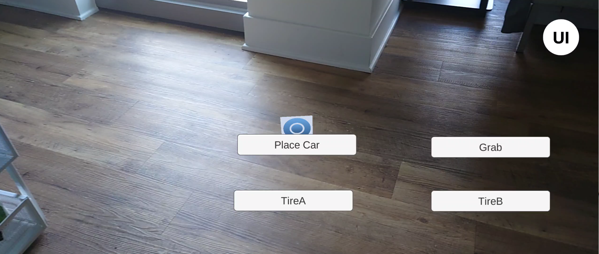

# F1 Crew Simulator

## Introduction

In this game, you play as the F1 crew member to fix the car that gets into the service area as soon as possible by changing all it's wheels.

## AR Application Design

- Interaction
  - In this game, user will need to change the tire, so the interaction between user and tire is quiet important. In this case, the app has placed the tire on the ground and follows the raycast of the user's camera making it easier for user to operate

## Integration

This app is build using unity and Android AR SDK. So no other software or hardware are being used in the progress

- Core code for finding the raycast hit point

  - The code below use the raycast form the center of user's camera to find the nearest hit point on the virtual sphere that ar SDK discovers.

- ```C#
  private void UpdatePlacementPose()
      {
          var screenCenter = Camera.current.ViewportToScreenPoint(new Vector3(0.5f, 0.5f));
          var hits = new List<ARRaycastHit>();
       
          arOrigin.GetComponent<ARRaycastManager>().Raycast(screenCenter, hits, UnityEngine.XR.ARSubsystems.TrackableType.PlaneEstimated);
  
          placementPoseIsValid = hits.Count > 0;
          if (placementPoseIsValid)
          {
              placementPose = hits[0].pose;
  
              var cameraForward = Camera.current.transform.forward;
              var cameraBearing = new Vector3(cameraForward.x, 0, cameraForward.z).normalized;
              placementPose.rotation = Quaternion.LookRotation(cameraBearing);
          }
      }
  ```

- Core code for car/tire generation

  - This code below uses the location information provided by the raycast above to generate the object needed in the APP at the location where user wants

- ```c#
  public void PlaceObject() {
  
          string buttonName = EventSystem.current.currentSelectedGameObject.name;
  
          for (int i = 0; i < buttons.Length; i++) {
  
              if (buttons[i].name == buttonName) {
  
                  objIndex = i;
              }
          }
  
          virtual_objects[objIndex].SetActive(true);
          virtual_objects[objIndex].transform.position = placementPose.position;
      }
  ```

- Core codes for tire removal

  - Use the raycast to find the nearest object, if the object is a tire, the program will hold up the tire until user hit grab button again.

- ```C#
  public void Remove(){
          RaycastHit hit;
          if (status == 0){
              if (Physics.Raycast(arCamera.transform.position,arCamera.transform.forward,out hit)){
                  if (hit.transform.tag == "tire"){
                      hold = hit.transform.gameObject;
                      Instantiate(popSound);
                      status =1;
                  }
              }
          }
          if (status == 1){
              hold = empty;
              status =0;
          }
  
          
      }
  
      void Update()
      {   
          if (status == 1){
              UpdatePlacementPose();
              UpdatePlacementIndicator();
          }else{
              status = 0;
          }
      }
  private void UpdatePlacementIndicator()
      {
          if (placementPoseIsValid && status==1)
          {
              hold.transform.SetPositionAndRotation(placementPose.position, placementPose.rotation);
          }
          
      }
  
      private void UpdatePlacementPose()
      {
          var screenCenter = Camera.current.ViewportToScreenPoint(new Vector3(0.5f, 0.5f));
          var hits = new List<ARRaycastHit>();
       
          arOrigin.GetComponent<ARRaycastManager>().Raycast(screenCenter, hits, UnityEngine.XR.ARSubsystems.TrackableType.PlaneEstimated);
  
          placementPoseIsValid = hits.Count > 0;
          if (placementPoseIsValid)
          {
              placementPose = hits[0].pose;
  
              var cameraForward = Camera.current.transform.forward;
              var cameraBearing = new Vector3(cameraForward.x, 0, cameraForward.z).normalized;
              placementPose.rotation = Quaternion.LookRotation(cameraBearing);
          }
      }
  ```

## User experience

- 3D interaction
  - In this app, use need to change the tire of the car.
  - But tires are on both side of the car, so I made the car smaller than it should be to make user easier to go around the car and fix it.
- Placement indicator
  - In this app, all car and tires are placed upon sphere that the AR sdk recognize. It's hard for user to tell where exactly where the object will be placed. So a placement indicator is added to mark the exact location that the object will be placed so user can determine the location easily.
- Sound effect
  - Sound effects are played upon success tire removal and assembly.

## Conclusion

- Worked
  - The car fix part works and is pretty fun
  - User can choose from different types of tires to fix the car.
- Not worked
  - I planned to have the car drives into the service area and user will wait for the car to drive in, then fix the car, and car drives out.
    - But in reality, this performs a little bit wired in AR, as we usually use AR in room so the space is limited. And the car driving around will surely hit into the wall. So I removed this part and the car will stay still in the progress

## Future work

- Add cars in motion to make the simulator more realistic
  - Find smarter way to interact with the car that doesn't hit the wall or player

- Add multiple player co-op mode
  - This mode would be very fun as multiple crew member to engage and fix the car simultaneously. Just like the real crew member.

## Lesson Learned

- Raycast
  - In this app, raycast is heavily used to determine the location where user wants to interact. Ray cast is a imaginary ray emits from the center of the user  screen and hit the spere that detected by the AR sdk. And feed back the hit location to the program. Then the program will use this location as object generation location.
- Trigger
  - In this app, the trigger is used to determine a success fix. As user move the tire into trigger area, the trigger will detect the object with tag `tire`. With all four triggers are triggered, the car is successfully fixed 
- AR detection
  - AR sdk is very useful in the app development. And it can detect the sphere quite efficiently and then user can place all kind of item on to the detected sphere.

## Feed back

This is overall a satisfying project. But I could have done better if more time is being provided. Two weeks are really short for developing a sophisticated AR APP.

## Appendix

- Upon opening, you'll see the interface like this after a few seconds, (please allow camera access)
  - if the interface failed to show up, please change to a more flat place with decent environment lightening.
- 

- After this, please select a appropriate location to place the car.
- 

- Then, press grab against the wheels to remove them
- 
- Lastly please choose the type of wheel you want to fix the car.
- 


